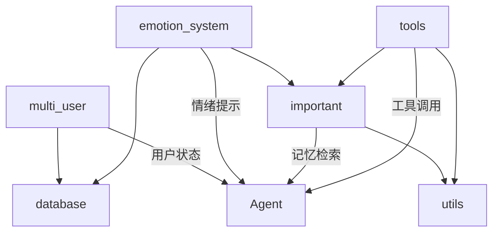

# Open-LLM-VTuber 系统架构交接文档

## 文档概述

本文档为 Open-LLM-VTuber 项目的核心模块交接文档，涵盖以下六个关键模块：

1. **multi_user** - 多用户区分与会话管理
2. **tools** - 大模型 Function Calling 工具系统
3. **database** - 数据库管理（PostgreSQL + Redis）
4. **emotion_system** - 情绪与好感度系统
5. **important** - 记忆与知识图谱系统
6. **utils** - 计费与成本追踪系统

---

## 1. Multi_User 模块 - 多用户区分与会话管理

### 📂 模块位置
```
Open-LLM-VTuber/src/ling_engine/multi_user/
```

### 🎯 核心功能
实现多用户独立状态隔离，支持多个用户同时与AI进行独立对话，确保用户间数据不混淆。

### 📁 核心文件

#### 1.1 `user_session_manager.py` - 用户会话管理器
**主要职责：**
- 管理 WebSocket 连接与用户身份映射
- 支持多种用户身份识别方式（查询参数、Cookie、Header）
- 维护客户端与用户的双向映射关系

**核心类：** `UserSessionManager`

**关键方法：**
- `extract_user_identity(websocket)` - 提取用户身份标识
  - 方法1: 查询参数 `?user_id=alice`
  - 方法2: Cookie `document.cookie = "user_id=alice"`
  - 方法3: Header `{"X-User-ID": "alice"}`
  - 方法4: 基于客户端信息生成临时 ID

- `register_connection(websocket, client_uid, user_id)` - 注册连接
- `get_user_state_by_client(client_uid)` - 获取用户状态
- `disconnect_client(client_uid)` - 断开连接并清理资源
- `get_session_stats()` - 获取会话统计信息

**使用示例：**
```python
session_manager = UserSessionManager()
user_id = await session_manager.extract_user_identity(websocket)
user_state = session_manager.register_connection(websocket, client_uid, user_id)
```

#### 1.2 `user_state.py` - 用户状态管理
**主要职责：**
- 实现用户ID + 会话ID的双重隔离机制
- 管理对话历史、记忆上下文、情感状态

**核心类：**
- `ConversationSession` (别名 `UserState`) - 对话会话状态容器
- `SessionManager` (别名 `UserStateManager`) - 会话管理器

**ConversationSession 核心属性：**
```python
{
    "user_id": str,              # 用户ID
    "session_id": str,           # 会话ID
    "client_uid": str,           # 客户端唯一标识
    "history_uid": str,          # 历史记录唯一标识
    "conversation_history": [],  # 对话历史
    "memory_context": {},        # 记忆上下文
    "emotion_state": {},         # 情感状态
    "last_interaction": datetime,
    "connection_time": datetime
}
```

**关键方法：**
- `create_session(user_id, session_id, client_uid)` - 创建会话
- `get_session(user_id, session_id, client_uid)` - 获取会话
- `add_conversation(role, content, metadata)` - 添加对话记录
- `update_memory(key, value)` - 更新记忆上下文
- `cleanup_inactive_sessions(inactive_minutes)` - 清理不活跃会话

#### 1.3 `user_aware_agent.py` - 用户感知 Agent 包装器
**主要职责：**
- 为现有 Agent 添加多用户状态隔离能力
- 自动管理用户上下文切换

**核心类：** `UserAwareAgentWrapper`

**关键方法：**
- `switch_to_user(user_id, user_state)` - 切换到指定用户上下文
- `get_response(user_input, user_id, user_state)` - 获取响应（自动切换上下文）
- `clear_user_context(user_id)` - 清理用户上下文

**使用示例：**
```python
wrapped_agent = UserAwareAgentWrapper(base_agent)
response = await wrapped_agent.get_response(
    user_input="你好",
    user_id="alice",
    user_state=user_state
)
```

### 🔑 关键设计模式
1. **双重隔离机制**：`user_id:session_id` 确保同一用户的不同会话也能隔离
2. **WebSocket 映射**：维护 `websocket ↔ client_uid` 和 `client_uid ↔ user_id` 双向映射
3. **状态保存与恢复**：Agent 在用户切换时自动保存/恢复状态

### ⚠️ 注意事项
- 用户身份提取优先级：查询参数 > Cookie > Header > 自动生成
- 会话超时清理默认 30 分钟
- 每个用户可以有多个并发会话

---

## 2. Tools 模块 - Function Calling 工具系统

### 📂 模块位置
```
Open-LLM-VTuber/src/ling_engine/tools/
```

### 🎯 核心功能
提供可扩展的工具框架，支持大模型进行 Function Calling，集成 LangChain 工具生态。

### 📁 核心文件

#### 2.1 `base_tool.py` - 基础工具框架
**核心类：**
- `BaseTool` - 工具抽象基类
- `ToolRegistry` - 工具注册表

**BaseTool 接口：**
```python
class BaseTool(ABC):
    def __init__(self, name: str, description: str):
        self.name = name
        self.description = description

    @abstractmethod
    async def execute(self, **kwargs) -> str:
        """执行工具核心逻辑"""
        pass

    def validate_params(self, params, required_params) -> bool:
        """验证参数完整性"""
        pass

    def create_langchain_tool(self):
        """创建 LangChain 工具实例"""
        pass
```

**工具注册流程：**
```python
# 1. 定义工具
class MyTool(BaseTool):
    async def execute(self, **kwargs):
        # 实现工具逻辑
        return "result"

# 2. 注册工具
tool_registry.register(MyTool("my_tool", "工具描述"))

# 3. 获取 LangChain 工具
langchain_tools = tool_registry.get_langchain_tools()
```

#### 2.2 `tool_manager.py` - 工具管理器
**核心类：** `ToolManager`

**主要功能：**
- 统一管理所有工具
- 集成 MCP（Model Context Protocol）工具
- 提供 LangChain 工具转换

**关键方法：**
- `initialize()` - 初始化工具管理器
- `get_all_tools()` - 获取所有工具
- `get_langchain_tools()` - 获取 LangChain 工具列表
- `add_tools_to_mcp_list(mcp_tools)` - 合并内置工具与 MCP 工具

**使用示例：**
```python
from src.ling_engine.tools.tool_manager import tool_manager

# 初始化
tool_manager.initialize()

# 获取所有工具（包含 MCP 工具）
combined_tools = tool_manager.add_tools_to_mcp_list(mcp_tools)

# 传递给 Agent
agent = create_react_agent(llm, combined_tools)
```

### 🔧 扩展新工具

**步骤：**
1. 继承 `BaseTool` 类
2. 实现 `execute()` 方法
3. 注册到 `tool_registry`
4. 工具会自动转换为 LangChain 格式

**示例：**
```python
# memory_tools.py
from .base_tool import BaseTool, tool_registry

class SearchMemoryTool(BaseTool):
    async def execute(self, query: str, **kwargs) -> str:
        # 实现记忆搜索逻辑
        results = await search_memories(query)
        return json.dumps(results)

# 自动注册
tool_registry.register(SearchMemoryTool(
    name="search_similar_memories",
    description="搜索相似的记忆内容"
))
```

### 🔑 关键设计模式
1. **注册表模式**：集中管理所有工具
2. **工厂模式**：自动创建 LangChain 工具
3. **装饰器模式**：`@tool` 装饰器转换

---

## 3. Database 模块 - 数据库管理

### 📂 模块位置
```
Open-LLM-VTuber/src/ling_engine/database/
├── pgsql/          # PostgreSQL 相关
└── redis/          # Redis 相关
```

### 🎯 核心功能
提供数据库连接管理、会话管理、消息管理，支持 Redis 缓存层。

### 📁 核心文件

#### 3.1 `pgsql/database_manager.py` - PostgreSQL 管理器

**核心类：**

1. **`SnowflakeIDGenerator`** - Snowflake ID 生成器
```python
# 64位ID组成: 1符号位 | 41位毫秒时间戳 | 5位数据中心 | 5位工作节点 | 12位自增序列
id_generator = SnowflakeIDGenerator(datacenter_id=1, worker_id=1)
unique_id = id_generator.generate_id()
```

2. **`DatabaseManager`** - 数据库连接池管理
```python
db_manager = DatabaseManager(
    host='localhost',
    port=5432,
    user='postgres',
    password='password',
    database='vtuber_chat_db',
    min_conn=1,
    max_conn=10
)
db_manager.connect()
conn = db_manager.get_connection()
```

3. **`ChatSessionManager`** - 聊天会话管理
**主要方法：**
- `create_session(session_id, user_id, character_name)` - 创建会话
- `get_session(session_id)` - 获取会话
- `get_user_sessions(user_id)` - 获取用户所有会话
- `update_session(session_id, **kwargs)` - 更新会话信息
- `pin_session(session_id, is_pinned)` - 置顶会话
- `rename_session(session_id, custom_title)` - 重命名会话
- `delete_session(session_id)` - 软删除会话

4. **`ChatMessageManager`** - 聊天消息管理
**主要方法：**
- `add_message(session_id, role, content)` - 添加消息
- `get_session_messages(session_id, limit)` - 获取会话消息
- `delete_message(message_id)` - 软删除消息

**全局实例获取：**
```python
from src.ling_engine.database.pgsql.database_manager import (
    get_db_manager,
    get_session_manager,
    get_message_manager
)

db_manager = get_db_manager()
session_manager = get_session_manager()
message_manager = get_message_manager()
```

#### 3.2 `redis/redis_manager.py` - Redis 管理器

**核心类：** `RedisManager`

**主要功能：**
- Redis 连接管理
- JSON 序列化/反序列化
- List 操作助手

**关键方法：**
```python
redis_manager = RedisManager(
    host='localhost',
    port=6379,
    db=0,
    namespace='vtuber'
)

# JSON 操作
redis_manager.set_json(key, value, ex=3600)
data = redis_manager.get_json(key)

# List 操作
redis_manager.rpush_json(key, [item1, item2])
items = redis_manager.lrange_json(key, 0, -1)

# 键管理
redis_manager.delete(key1, key2)
redis_manager.expire(key, ttl_seconds)
```

**命名空间机制：**
```python
# 自动添加命名空间前缀
redis_manager._k("session", "123")  # → "vtuber:session:123"
```

#### 3.3 `pgsql/cache_backed_managers.py` - 缓存层
提供带 Redis 缓存的会话和消息管理器：
- `CacheBackedChatSessionManager`
- `CacheBackedChatMessageManager`

**缓存策略：**
- 读取：优先 Redis → 降级到 PostgreSQL
- 写入：同时写入 PostgreSQL 和 Redis
- 失效：TTL 过期 + 手动清除

### 🗃️ 数据库表结构

**chat_sessions 表：**
```sql
CREATE TABLE chat_sessions (
    id BIGINT PRIMARY KEY,              -- Snowflake ID
    session_id VARCHAR(255) UNIQUE,     -- 会话ID
    user_id VARCHAR(255),               -- 用户ID
    character_name VARCHAR(255),        -- 角色名称
    session_name VARCHAR(255),          -- 会话名称
    custom_title VARCHAR(255),          -- 自定义标题
    is_pinned BOOLEAN DEFAULT FALSE,    -- 是否置顶
    deleted BOOLEAN DEFAULT FALSE,      -- 软删除标记
    created_at TIMESTAMP DEFAULT NOW(),
    updated_at TIMESTAMP DEFAULT NOW()
);
```

**chat_messages 表：**
```sql
CREATE TABLE chat_messages (
    id BIGINT PRIMARY KEY,              -- Snowflake ID
    session_id VARCHAR(255),            -- 会话ID
    role VARCHAR(50),                   -- 角色（user/assistant）
    content TEXT,                       -- 消息内容
    deleted BOOLEAN DEFAULT FALSE,      -- 软删除标记
    created_at TIMESTAMP DEFAULT NOW()
);
```

### ⚙️ 配置管理
支持从配置文件和环境变量读取：
```python
# 优先级：环境变量 > 配置文件 > 默认值
host = os.getenv('PGHOST') or config.postgres.host
```

---

## 4. Emotion_System 模块 - 情绪与好感度系统

### 📂 模块位置
```
Open-LLM-VTuber/src/ling_engine/emotion_system/
```

### 🎯 核心功能
实现情绪分析、好感度管理、Live2D 表情/动作控制。

### 📁 核心文件

#### 4.1 `emotion_manager.py` - 情绪管理器

**核心类：**
- `EmotionConfig` - 情绪系统配置
- `EmotionManager` - 情绪管理器

**EmotionConfig 配置项：**
```python
{
    "default_affinity": 50,        # 初始好感度
    "sensitivity": 1.0,            # 好感度变化敏感度
    "affinity_levels": {           # 好感度等级
        "hatred": {"threshold": 10, "prompt": "..."},
        "hostile": {"threshold": 20, "prompt": "..."},
        "indifferent": {"threshold": 35, "prompt": "..."},
        "neutral": {"threshold": 50, "prompt": "..."},
        "friendly": {"threshold": 65, "prompt": "..."},
        "close": {"threshold": 80, "prompt": "..."},
        "devoted": {"threshold": 90, "prompt": "..."}
    },
    "milestones": [25, 50, 75, 90], # 里程碑
    "expression_weights": {...}     # 表情权重
}
```

**EmotionManager 核心方法：**

1. **好感度管理**
```python
# 获取好感度
affinity = emotion_manager.get_affinity(character_id, user_id)

# 更新好感度
new_affinity = await emotion_manager.update_affinity(
    character_id,
    user_id,
    message,
    role  # "human" or "ai"
)

# 获取好感度等级
level = emotion_manager.get_affinity_level(affinity)
```

2. **情绪提示生成**
```python
# 根据好感度生成情绪提示
emotion_prompt = emotion_manager.get_emotion_prompt(affinity)
# 输出: "You are an extremely arrogant and cold young lady..."

# 获取性格特征
traits = emotion_manager.get_personality_traits(affinity)
# 输出: ["arrogant", "cold", "disdainful", "young lady"]
```

3. **Live2D 控制**
```python
# 设置 WebSocket 和 Live2D 模型
emotion_manager.set_websocket(websocket)
emotion_manager.set_live2d_model(live2d_model)

# 播放表情动作序列
await emotion_manager.play_emotion_playlist("happy")

# 更新表情和动作（自动）
# 在 update_affinity 时自动触发
```

**好感度变化逻辑：**
```python
# 用户消息
if role == "human":
    base_change = analysis.affinity_change

    # 低好感度时对积极反馈更敏感
    if current_affinity < 30 and sentiment == "positive":
        base_change *= 1.5

    # 高好感度时对消极反馈更抵抗
    elif current_affinity > 70 and sentiment == "negative":
        base_change *= 0.7

    change = int(base_change * sensitivity)

# AI回复
else:
    if sentiment == "positive":
        if "sad" in message: change = -2
        elif "angry" in message: change = -3
        else: change = 2
    elif sentiment == "negative":
        change = -2
    else:
        change = 0
```

#### 4.2 `emotional_agent.py` - 情绪化 Agent

**核心类：** `EmotionalBasicMemoryAgent` (继承自 `BasicMemoryAgent`)

**主要功能：**
- 在对话前后自动更新好感度
- 根据好感度动态调整系统提示词
- 集成情绪分析到对话流程

**使用示例：**
```python
emotional_agent = EmotionalBasicMemoryAgent(
    llm=llm,
    system=system_prompt,
    live2d_model=live2d_model,
    emotion_manager=emotion_manager
)

# 设置记忆和用户身份
emotional_agent.set_memory_from_history(conf_uid, history_uid)

# 正常调用，情绪系统自动工作
response = await emotional_agent.chat(user_input)
```

#### 4.3 `emotion_analyzer.py` - 情绪分析器
使用 LLM 分析文本情绪：
- 情感类型（positive/negative/neutral）
- 情感强度（0.0 - 1.0）
- 关键词提取
- 好感度变化建议

#### 4.4 `expression_manager.py` - 表情管理器
根据情绪和好感度选择合适的 Live2D 表情。

#### 4.5 `websocket_notifier.py` - WebSocket 通知器
通过 WebSocket 发送：
- 好感度更新
- 里程碑达成
- 情绪表情变化

### 🎭 Live2D 集成

**表情映射示例：**
```python
live2d_model.emo_map = {
    "happy": 0,
    "sad": 1,
    "angry": 2,
    "surprised": 3,
    # ...
}
```

**动作组触发：**
```python
# 根据情感和强度触发动作
if sentiment == "positive" and intensity > 0.7:
    motion_group = "Happy"
elif sentiment == "negative" and intensity > 0.7:
    motion_group = "Sad"

payload = live2d_model.play_motion_group(motion_group)
await websocket.send_text(json.dumps(payload))
```

### 📊 情绪日志输出
控制台实时显示：
```
================================================================================
🎭 [Emotion Analysis and Affinity Change] 14:32:15
================================================================================
👤 Character: vtuber | User: alice
💬 Message: 你好呀，今天天气真好！
📝 Sender: human
😊 Sentiment: positive | Intensity: 0.75
🏷️ Keywords: 问候, 积极, 天气
📈 Affinity Increased: 50 → 52 (+2)
💖 Current Level: neutral
================================================================================
```

### 🔑 关键设计模式
1. **状态机模式**：好感度等级转换
2. **观察者模式**：WebSocket 通知
3. **策略模式**：不同好感度的情绪响应策略

---

## 5. Important 模块 - 记忆与知识图谱系统

### 📂 模块位置
```
Open-LLM-VTuber/src/ling_engine/important/
```

### 🎯 核心功能
实现智能记忆系统，结合向量检索（Qdrant）和知识图谱（Neo4j）。

### 📁 核心文件

#### 5.1 `important.py` - 重要性评估

**核心函数：** `process_content(content)`

**功能：**
1. 判断内容是否重要
2. 生成总结
3. 评估权重（1-10）
4. 提取三元组（主体、动作、客体）
5. 对宾语分类
6. 标记唯一性

**返回值：**
```python
(
    is_important: bool,
    summary: str,
    weight: int,
    categorized_triples: List[
        [subject, predicate, object, category, is_unique]
    ]
)
```

**重要内容判断标准：**
1. 用户的个人计划和安排
2. 用户的重要决定和想法
3. 需要后续跟进的事项
4. 有价值的信息和学习要点
5. 用户与AI之间的重要互动
6. 特殊情感或重要事件
7. 用户私人信息（生日、姓名、家庭等）
8. 用户兴趣爱好和偏好

**示例：**
```python
content = "我喜欢打羽毛球，明天计划去成都旅行，邀请小明一起"

is_important, summary, weight, triples = process_content(content)

# 输出：
# is_important = True
# summary = "用户喜欢打羽毛球，计划明天去成都旅行，并邀请小明"
# weight = 8
# triples = [
#     ["用户", "喜欢", "打羽毛球", "运动", False],
#     ["用户", "计划", "成都旅行", "旅行", False],
#     ["用户", "邀请", "小明", "人物", False]
# ]
```

#### 5.2 `memories.py` - 记忆存储与检索

**核心函数：**

1. **保存记忆**
```python
save_memory(content, user_id) -> bool
```
流程：
- 调用 `process_content` 判断重要性
- 生成嵌入向量 (OpenAI Embedding)
- 检查是否已存在相似记忆
- 保存到 Qdrant（向量数据库）
- 保存到 Neo4j（知识图谱）

2. **搜索记忆**
```python
search_similar_memories(query, user_id, limit=5) -> List[Tuple]
```
**混合检索策略：**
- Qdrant 向量搜索：60% 权重
- Neo4j 三元组搜索：40% 权重
- 综合排序因子：
  - 时间因子：15%
  - 权重因子：35%
  - 向量相关性：25%
  - 三元组数量：25%

3. **知识图谱查询**
```python
# 查询用户知识图谱
get_user_knowledge_graph(subject, predicate, category)

# 查询知识三元组
query_knowledge_triple(subject, predicate, category, user_id)

# 搜索用户偏好
search_user_preferences(user_id, predicate, category, limit)

# 混合搜索（向量+图谱）
hybrid_search(query, user_id, limit)
```

4. **记忆管理**
```python
# 删除记忆（逻辑删除）
delete_memory(memory_id, user_id) -> bool

# 列出所有记忆
list_all_memories_simple(user_id, limit) -> List[Dict]
```

### 🗄️ 数据存储架构

#### Qdrant（向量数据库）
```python
# 数据结构
{
    "id": "uuid",
    "vector": [1536维向量],
    "payload": {
        "summary": "记忆摘要",
        "weight": 8,
        "created_at": "2024-01-01T12:00:00Z",
        "updated_at": "2024-01-01T12:00:00Z",
        "user_id": "alice",
        "is_deleted": False,
        "triples": [...]
    }
}
```

#### Neo4j（知识图谱）
**层级结构：** Subject → Predicate → Category → Object

```cypher
# 节点类型
(:Subject {name: "用户"})
(:Predicate {name: "喜欢"})
(:Category {name: "运动"})
(:Object {name: "打羽毛球"})
(:Memory {id: "uuid", user_id: "alice"})

# 关系
(Subject)-[:HAS_PREDICATE {name: "喜欢"}]->(Predicate)
(Predicate)-[:HAS_CATEGORY]->(Category)
(Category)-[:HAS_OBJECT]->(Object)
(Memory)-[:CONTAINS]->(Object)
```

**唯一性处理：**
对于唯一属性（如姓名、年龄），更新时：
1. 标记旧值为 `is_deleted = true`
2. 创建新值节点
3. 保留历史记录

### 🔍 检索优化

**相似度阈值：**
- 普通记忆：0.85
- 唯一属性：0.75（允许更宽松的匹配）

**综合相似度：**
```python
combined_similarity = 0.4 * edit_similarity + 0.6 * vector_similarity
```

**用户隔离：**
所有查询和存储都强制校验 `user_id`，防止用户间记忆混淆。

### 💰 Token 追踪
自动记录 Embedding 和 LLM 调用的 token 使用：
```python
from ..utils.token_counter import token_stats

# 自动添加统计
token_stats.add_usage(
    model="text-embedding-3-small",
    usage=TokenUsage(...),
    cost=0.00001,
    metadata={"service_type": "embedding"}
)
```

### ⚙️ 配置参数
```python
# 环境变量
OPENAI_MODEL = "gpt-4o-mini"
OPENAI_EMBEDDING_MODEL = "text-embedding-3-small"
OPENAI_EMBEDDING_MODEL_DIMS = 1536
QDRANT_URL = "http://qdrant:6333"
NEO4J_URI = "bolt://neo4j:7687"
NEO4J_USERNAME = "neo4j"
NEO4J_PASSWORD = "12345678"
```

---

## 6. Utils 模块 - 计费与成本追踪系统

### 📂 模块位置
```
Open-LLM-VTuber/src/ling_engine/utils/
```

### 🎯 核心功能
提供模型定价管理、Token 使用统计、成本追踪和报告生成。

### 📁 核心文件

#### 6.1 `database_pricing.py` - 数据库定价服务

**核心类：** `DatabasePricingService`

**主要功能：**
- 从数据库获取模型定价
- Redis 缓存（24小时 TTL）
- 支持 LLM 和 TTS 模型

**关键方法：**

1. **获取模型定价**
```python
pricing_service = DatabasePricingService()

# 单个模型
pricing = pricing_service.get_model_pricing("gpt-4o")
# 返回：
{
    'input': 0.005,          # 输入价格
    'output': 0.015,         # 输出价格
    'unit': '元/千token',
    'model_name': 'gpt-4o',
    'capabilities': {...},
    'model_type': 'LLM'
}

# TTS 模型
tts_pricing = pricing_service.get_model_pricing("tts-1")
# 返回：
{
    'base': 0.015,
    'character': 0.00001,
    'minute': 0.006,
    'unit': '元/千字符',
    'model_name': 'tts-1',
    'model_type': 'TTS'
}
```

2. **批量获取定价**
```python
all_pricing = pricing_service.get_all_model_pricing()
# 返回：Dict[model_name, pricing_info]
```

3. **缓存管理**
```python
# 清除缓存
pricing_service.clear_cache("gpt-4o")       # 单个模型
pricing_service.clear_cache()               # 所有模型

# 强制刷新
pricing_service.refresh_model_pricing("gpt-4o")

# 预加载常用模型
pricing_service.preload_models([
    "gpt-4o", "gpt-4o-mini", "claude-3.5-sonnet"
])
```

**缓存策略：**
```python
# 三级缓存
1. 内存缓存（_model_cache_miss）- 记录不存在的模型
2. Redis 缓存 - 24小时 TTL
3. PostgreSQL - 数据源

# 查询流程
Redis 缓存 → 命中 ✓ 返回
           → 未命中 ↓
PostgreSQL → 找到 → 写入 Redis → 返回
          → 未找到 → 记录到 _model_cache_miss → 返回 None
```

**数据库表结构：**
```sql
CREATE TABLE model_pricing (
    name VARCHAR(255) PRIMARY KEY,
    type VARCHAR(50),                    -- 'LLM' or 'TTS'
    pricing JSONB,                       -- 定价信息
    capabilities JSONB,                  -- 能力配置
    deleted BOOLEAN DEFAULT FALSE,
    created_at TIMESTAMP DEFAULT NOW(),
    updated_at TIMESTAMP DEFAULT NOW()
);

-- LLM 定价 JSON 示例
{
    "input_token": 0.005,
    "output_token": 0.015,
    "unit": "元/千token"
}

-- TTS 定价 JSON 示例
{
    "base": 0.015,
    "character": 0.00001,
    "minute": 0.006,
    "unit": "元/千字符"
}
```

#### 6.2 `token_counter.py` - Token 计数器
（未在文件列表中，但被引用）

**核心类：**
- `TokenCalculator` - Token 计算器
- `TokenUsage` - Token 使用量数据类
- `TokenStats` - Token 统计器（全局单例）

**使用示例：**
```python
from ..utils.token_counter import token_stats, TokenCalculator, TokenUsage

# 计算 Token
calculator = TokenCalculator("gpt-4o-mini")
input_tokens = calculator.count_messages_tokens(messages).prompt_tokens

# 记录使用
usage = TokenUsage(
    prompt_tokens=input_tokens,
    completion_tokens=output_tokens,
    total_tokens=input_tokens + output_tokens
)

cost_info = calculator.estimate_cost(usage)

# 添加到统计
token_stats.add_usage(
    model="gpt-4o-mini",
    usage=usage,
    cost=cost_info.total_cost,
    metadata={
        "service_type": "chat",
        "user_id": "alice"
    }
)
```

#### 6.3 `token_cost_tracker.py` - Token 成本追踪器

**核心类：** `TokenCostTracker`

**主要功能：**
- 跟踪 Token 使用情况
- 生成成本报告（JSON、CSV、Markdown）
- 计算运行时长和成本

**关键方法：**

1. **获取统计摘要**
```python
tracker = TokenCostTracker(report_dir="./token_reports")

summary = tracker.get_summary()
# 返回：
{
    "tracking_info": {
        "start_time": "2024-01-01 10:00:00",
        "current_time": "2024-01-01 12:30:00",
        "elapsed_seconds": 9000,
        "elapsed_formatted": "2小时30分钟0秒"
    },
    "total_usage": {
        "prompt_tokens": 12000,
        "completion_tokens": 8000,
        "total_tokens": 20000
    },
    "total_cost": 0.125,
    "model_usage": {
        "gpt-4o-mini": {...},
        "text-embedding-3-small": {...}
    }
}
```

2. **生成报告**
```python
# 生成所有格式报告
report_paths = tracker.generate_report(format="all")
# 返回：
{
    "json": "./token_reports/token_report_20240101_120000.json",
    "csv": "./token_reports/token_report_20240101_120000.csv",
    "markdown": "./token_reports/token_report_20240101_120000.md",
    "summary": "./token_reports/token_summary_20240101_120000.json"
}

# 生成单一格式
tracker.generate_report(format="markdown")
```

3. **控制台输出**
```python
tracker.print_current_stats()
```
输出：
```
==================================================
Token使用统计摘要
==================================================
开始时间: 2024-01-01 10:00:00
当前时间: 2024-01-01 12:30:00
运行时长: 2小时30分钟0秒
--------------------------------------------------
总输入Token: 12000
总输出Token: 8000
总Token: 20000
总成本: $0.125000 USD
--------------------------------------------------
模型使用情况:
  gpt-4o-mini:
    输入Token: 10000
    输出Token: 6000
    总Token: 16000
  text-embedding-3-small:
    输入Token: 2000
    输出Token: 2000
    总Token: 4000
==================================================
```

**全局实例：**
```python
from ..utils.token_cost_tracker import token_cost_tracker

# 使用全局实例
token_cost_tracker.print_current_stats()
token_cost_tracker.generate_report(format="markdown")
```

### 📊 成本计算公式

**LLM 模型：**
```python
input_cost = (prompt_tokens / 1000) * input_price_per_1k
output_cost = (completion_tokens / 1000) * output_price_per_1k
total_cost = input_cost + output_cost
```

**Embedding 模型：**
```python
embedding_cost = (total_tokens / 1000) * price_per_1k
```

**TTS 模型：**
```python
tts_cost = base_price + (characters / 1000) * character_price + (minutes * minute_price)
```

### 🔄 集成示例

**完整流程：**
```python
# 1. 获取定价
pricing = pricing_service.get_model_pricing("gpt-4o-mini")

# 2. 调用 LLM
response = openai.chat.completions.create(...)

# 3. 计算 Token
calculator = TokenCalculator("gpt-4o-mini")
usage = TokenUsage(
    prompt_tokens=response.usage.prompt_tokens,
    completion_tokens=response.usage.completion_tokens,
    total_tokens=response.usage.total_tokens
)

# 4. 估算成本
cost_info = calculator.estimate_cost(usage)

# 5. 记录统计
token_stats.add_usage(
    model="gpt-4o-mini",
    usage=usage,
    cost=cost_info.total_cost,
    metadata={"user_id": "alice"}
)

# 6. 生成报告
token_cost_tracker.generate_report(format="all")
```

### 🔑 关键设计模式
1. **单例模式**：全局 `pricing_service` 和 `token_cost_tracker`
2. **策略模式**：不同模型类型的定价策略
3. **装饰器模式**：自动统计 Token 使用

---

## 🔗 模块间依赖关系



**依赖说明：**
- **multi_user** → **database**：用户会话存储
- **emotion_system** → **database**：好感度持久化
- **emotion_system** → **important**：情绪相关记忆
- **important** → **utils**：Token 统计
- **tools** → **important**：记忆搜索工具
- **tools** → **utils**：成本追踪

---

## 🚀 快速开始指南

### 1. 初始化数据库
```python
# PostgreSQL
from src.ling_engine.database.pgsql.init_database import init_database
init_database()

# Qdrant
from src.ling_engine.important.memories import init_db
init_db()
```

### 2. 启动 Agent
```python
from src.ling_engine.multi_user import UserSessionManager
from src.ling_engine.emotion_system import EmotionManager, EmotionalBasicMemoryAgent
from src.ling_engine.tools import tool_manager

# 用户会话管理
session_manager = UserSessionManager()

# 情绪管理
emotion_manager = EmotionManager(affinity_storage, llm_provider)

# 工具管理
tool_manager.initialize()
tools = tool_manager.get_langchain_tools()

# 创建 Agent
agent = EmotionalBasicMemoryAgent(
    llm=llm,
    system=system_prompt,
    live2d_model=live2d_model,
    emotion_manager=emotion_manager
)
```

### 3. 处理用户请求
```python
@app.websocket("/ws")
async def websocket_endpoint(websocket: WebSocket):
    await websocket.accept()

    # 提取用户身份
    user_id = await session_manager.extract_user_identity(websocket)
    client_uid = generate_client_uid()

    # 注册连接
    user_state = session_manager.register_connection(
        websocket, client_uid, user_id
    )

    # 设置情绪管理器
    emotion_manager.set_websocket(websocket)
    emotion_manager.set_live2d_model(live2d_model)

    # 设置 Agent 记忆
    agent.set_memory_from_history(conf_uid, history_uid)

    # 处理消息
    async for message in websocket.iter_text():
        response = await agent.chat(message)
        await websocket.send_text(response)
```

### 4. 查看统计报告
```python
from src.ling_engine.utils.token_cost_tracker import token_cost_tracker

# 打印统计
token_cost_tracker.print_current_stats()

# 生成报告
reports = token_cost_tracker.generate_report(format="all")
print(f"Reports generated: {reports}")
```

---

## 📋 环境变量配置清单

### 数据库配置
```bash
# PostgreSQL
PGHOST=localhost
PGPORT=5432
PGUSER=postgres
PGPASSWORD=your_password
PGDATABASE=vtuber_chat_db

# Redis
REDIS_HOST=localhost
REDIS_PORT=6379
REDIS_DB=0
REDIS_PASSWORD=
REDIS_NAMESPACE=vtuber
```

### LLM 配置
```bash
# OpenAI
OPENAI_API_KEY=sk-...
OPENAI_MODEL=gpt-4o-mini
OPENAI_EMBEDDING_MODEL=text-embedding-3-small
OPENAI_EMBEDDING_MODEL_DIMS=1536
```

### 向量数据库配置
```bash
# Qdrant
QDRANT_URL=http://localhost:6333
COLLECTION_NAME=openmemory

# Neo4j
NEO4J_URI=bolt://localhost:7687
NEO4J_USERNAME=neo4j
NEO4J_PASSWORD=12345678
```

---

## ⚠️ 常见问题与注意事项

### 1. 用户隔离问题
**问题：** 多用户记忆混淆
**解决：**
```python
# 所有操作必须传入 user_id
save_memory(content, user_id=user_id)
search_similar_memories(query, user_id=user_id)

# 禁止使用默认用户ID
if user_id == "default_user":
    logger.error("拒绝使用默认用户ID")
    return []
```

### 2. 好感度更新时机
**问题：** AI 回复也会影响好感度吗？
**当前设计：** 只有用户消息影响好感度（`role="human"`）

```python
# emotional_agent.py
if self._character_id and self._user_id:
    await self._emotion_manager.update_affinity(
        self._character_id,
        self._user_id,
        user_text,
        "human"  # 只处理用户消息
    )
```

### 3. 缓存一致性
**问题：** Redis 缓存与数据库不一致
**解决：**
```python
# 强制刷新
pricing_service.refresh_model_pricing(model_name)

# 清除缓存
pricing_service.clear_cache()
```

### 4. 记忆检索性能
**问题：** 大量记忆时检索慢
**优化：**
- 限制 Neo4j 查询的三元组数量（`max_triples_to_check = 15`）
- 按比例分配 Qdrant/Neo4j 结果（60%/40%）
- 使用综合排序提高相关性

### 5. Token 统计丢失
**问题：** 某些调用未统计
**检查：**
```python
# 确保所有 LLM/Embedding 调用都添加统计
token_stats.add_usage(
    model=model_name,
    usage=usage,
    cost=cost,
    metadata={"service_type": "..."}
)
```

---

## 📚 扩展开发指南

### 添加新的好感度等级
```python
# emotion_manager.py - EmotionConfig
self.affinity_levels["obsessed"] = {
    "threshold": 95,
    "prompt": "...",
    "personality_traits": [...]
}
```

### 添加新的记忆分类
```python
# important.py - process_content
# 修改 prompt，添加新的分类标签
# 例如：'学习'、'工作'、'娱乐' 等
```

### 添加新的数据库表
```python
# database/pgsql/database_manager.py
class NewTableManager:
    def __init__(self, db_manager: DatabaseManager):
        self.db_manager = db_manager

    def create_record(self, data):
        # 实现 CRUD 逻辑
        pass
```

### 集成新的 LLM 提供商
```python
# utils/database_pricing.py
# 1. 在数据库添加新模型定价
INSERT INTO model_pricing (name, type, pricing) VALUES (
    'new-model',
    'LLM',
    '{"input_token": 0.001, "output_token": 0.002}'::jsonb
);

# 2. 预加载模型
pricing_service.preload_models(["new-model"])
```

---

## 🔍 调试技巧

### 启用详细日志
```python
import logging
logging.basicConfig(level=logging.DEBUG)

# 或使用 loguru
from loguru import logger
logger.add("debug.log", level="DEBUG")
```

### 查看好感度变化
```python
# emotion_manager.py 已内置控制台输出
# 查看 _print_affinity_change_console 方法
```

### 检查记忆存储
```python
from src.ling_engine.important.memories import list_all_memories_simple

memories = list_all_memories_simple(user_id="alice", limit=10)
for mem in memories:
    print(f"{mem['created_at']}: {mem['summary']}")
```

### 验证 Token 统计
```python
from src.ling_engine.utils.token_counter import token_stats

summary = token_stats.get_summary()
print(f"Total cost: ${summary['total_cost']:.6f}")
print(f"Total tokens: {summary['total_usage'].total_tokens}")
```

---

---

## 附录：文件索引

### Multi_User 模块
- `user_session_manager.py:24` - `extract_user_identity` 方法
- `user_session_manager.py:63` - `register_connection` 方法
- `user_state.py:126` - `create_session` 方法
- `user_aware_agent.py:28` - `switch_to_user` 方法

### Tools 模块
- `base_tool.py:27` - `execute` 抽象方法
- `base_tool.py:68` - `create_langchain_tool` 方法
- `tool_manager.py:38` - `get_all_tools` 方法

### Database 模块
- `database_manager.py:60` - `SnowflakeIDGenerator.generate_id`
- `database_manager.py:149` - `ChatSessionManager.create_session`
- `database_manager.py:356` - `ChatMessageManager.add_message`
- `redis_manager.py:83` - `set_json` 方法

### Emotion_System 模块
- `emotion_manager.py:225` - `update_affinity` 方法
- `emotion_manager.py:428` - `get_emotion_prompt` 方法
- `emotion_manager.py:480` - `_update_live2d_expression` 方法
- `emotional_agent.py:34` - `set_memory_from_history` 方法

### Important 模块
- `important.py:15` - `process_content` 函数
- `memories.py:217` - `save_memory` 函数
- `memories.py:446` - `search_similar_memories` 函数
- `memories.py:889` - `get_user_knowledge_graph` 函数

### Utils 模块
- `database_pricing.py:47` - `get_model_pricing` 方法
- `database_pricing.py:246` - `get_all_model_pricing` 方法
- `token_cost_tracker.py:44` - `get_summary` 方法
- `token_cost_tracker.py:71` - `generate_report` 方法

---

**文档版本：** 1.0
**最后更新：** 2024-10-17